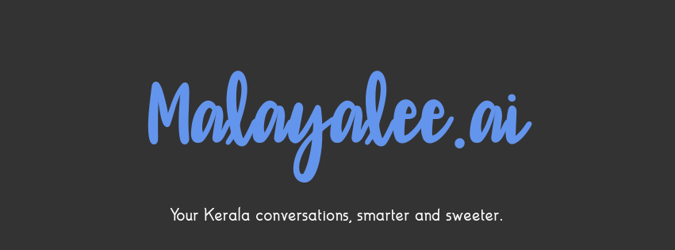

## 🌴 Malayalee.ai: Your Kerala Buddy!



Malayalee.ai is your friendly, AI-powered guide to the Malayalam language and culture, now with both text and voice interaction! It acts as your personal translator, conversation partner.

### ✨ Features

- **Malayalam In, Malayalam Out:** Type or speak in Malayalam, get responses in Malayalam—perfect for those comfortable in their native tongue.
- **Seamless Translation:**  Malayalee.ai effortlessly handles translation between Malayalam and English behind the scenes for natural communication.
- **Engaging Conversations:** Experience AI that understands and responds to your prompts in a way that feels distinctly Malayalee.
- **Voice Interaction:** Speak your requests and hear Malayalee.ai's replies, adding a new dimension to your interaction. 

### ⚙️ How It Works

1. **You Input:** Type a message or speak to Malayalee.ai in Malayalam.
2. **Translation (if needed):**  Your input is intelligently translated into English.
3. **AI Magic:** A powerful text generation model processes your English text and crafts a suitable response.
4. **Back to Malayalam:** The AI's response is translated back into natural-sounding Malayalam.
5. **You Hear (optional):** If you chose voice input, Malayalee.ai speaks the Malayalam response out loud! 

### 🚀 Getting Started 

1. **Prerequisites:**
   - **Git:**  [https://git-scm.com/](https://git-scm.com/)
   - **Python 3.8+:** [https://www.python.org/](https://www.python.org/)

2. **Clone the Project:**
   ```bash
   git clone https://github.com/Afnanksalal/Malayalee.ai.git 
   cd malayalee.ai
   ```

3. **Set Up:**
   ```bash
   pip install -r requirements.txt
   ```
   Make sure to install any additional dependencies based on error messages.

4. **Run Malayalee.ai:**
   ```bash
   python app.py
   ```
   Visit `http://127.0.0.1:5000/` (or the address shown in your terminal) in your web browser.

## 🗒️ License

This project is licensed under the MIT License. See the [LICENSE](LICENSE) file for more information.

## 📝 Acknowledgements

Malayalee.ai wouldn't be possible without these amazing open-source projects:

- **Flask:**  Web framework. [https://flask.palletsprojects.com/](https://flask.palletsprojects.com/)
- **Transformers:**  For NLP models. [https://huggingface.co/transformers/](https://huggingface.co/transformers/)

### 🫶 Attribution

When using this project, please attribute it as follows:

```
This project includes code from [Malayalee.ai](https://github.com/Afnanksalal/Malayalee.ai.git) by Afnan K Salal, licensed under the MIT License.
``` 
